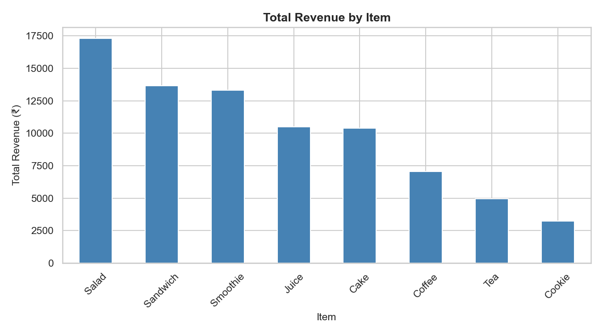
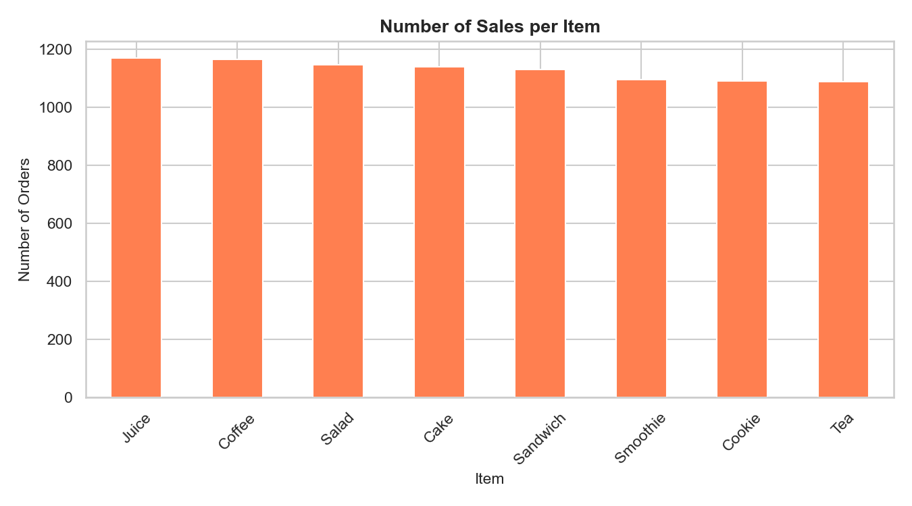
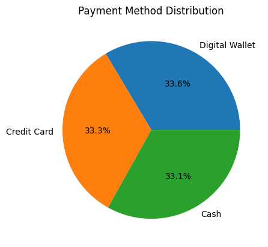
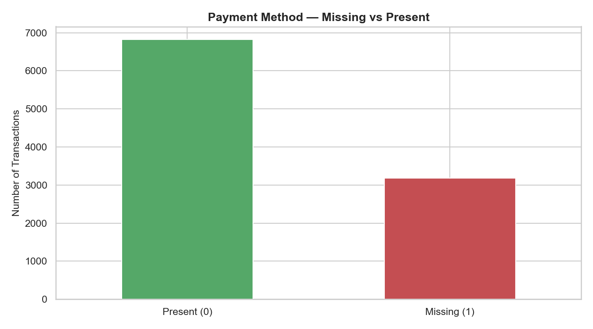

# Dirty Cafe Sales – Data Cleaning & Exploratory Data Analysis (EDA)

## Project Overview
This project documents the complete process of working with a messy, real-world cafe sales dataset.
The work starts with **data inspection and cleaning**, followed by **data validation**, and then
**exploratory data analysis (EDA)** to understand business patterns.

The focus of this project was to **do things in the correct order**:
first understand the data, then clean it safely, validate assumptions, and only then analyze it.
No data was dropped or guessed during cleaning.

---

## Dataset Description
The dataset (`dirty_cafe_sales.csv`) contains cafe transaction records, including:
- Transaction ID  
- Item sold  
- Quantity  
- Price per unit  
- Total spent  
- Payment method  
- Location  
- Transaction date  

The dataset contains:
- Incorrect data types
- Hidden missing values written as text
- Inconsistent and invalid entries

---

## Problems Found in the Data
During initial inspection, the following issues were identified:

- Numeric columns (`Quantity`, `Price Per Unit`, `Total Spent`) were stored as text.
- Missing values were hidden using placeholders such as:
  - `error`, `unknown`, blank spaces, `na`, `n/a`, `none`
- Some columns had a high percentage of missing values.
- Transaction date was stored as text instead of a proper date format.
- Calculations could not be trusted before cleaning.

---

## Process Followed

### 1. Initial Data Inspection
- Viewed sample rows to understand the structure.
- Checked column names and data types.
- Identified missing and invalid values.
- No modifications were made at this stage.

---

### 2. Raw Data Preservation
Before performing any cleaning:
- A complete copy of the original dataset was saved as a raw file.

This ensures:
- Original data is always available.
- All changes are traceable.
- No irreversible data loss occurs.

---

### 3. Cleaning Text (Categorical) Columns
For columns such as **Item**, **Payment Method**, and **Location**:
- Converted text to lowercase for consistency.
- Removed extra spaces.
- Identified placeholder values representing missing data.
- Replaced placeholders with proper missing values (`NaN`).
- Created missing-value indicator columns (1 = missing, 0 = not missing).

This made missing data explicit instead of hidden.

---

### 4. Cleaning Numeric Columns
For **Quantity**, **Price Per Unit**, and **Total Spent**:
- Created backup copies of original values.
- Converted columns to numeric format using safe conversion.
- Invalid numeric values were converted to missing values.
- Verified numeric ranges to ensure values were realistic.

---

### 5. Logical Validation
A basic business rule was validated:
- **Total Spent = Quantity × Price Per Unit**

This ensured numeric values were logically consistent after cleaning.

---

## Exploratory Data Analysis (EDA)

### Key Questions Explored
The analysis focused on answering the following business questions:
1. How much total revenue does the cafe generate?
2. Which items are sold most frequently?
3. Which items generate the most revenue?
4. How do customers prefer to pay?
5. How does missing data affect the analysis?

---

### Key Findings
- The cafe generated approximately **₹88,952** in revenue.
- **9,960 valid transactions** were used for revenue analysis.
- Sales volume and revenue contribution are not the same.
- Items like **Salad** and **Sandwich** generate higher revenue despite similar sales counts.
- Payment methods are used almost equally among recorded transactions.
- A significant number of transactions are missing payment method information, limiting analysis reliability.

---

## Visual Analysis
Visualizations were created to support the findings, including:
- Revenue by item
- Sales count by item
- Payment method distribution
- Missing payment method impact

### Revenue by Item

### Sales Count by Item

### Payment Method Distribution

### Missing Payment Method Impact

